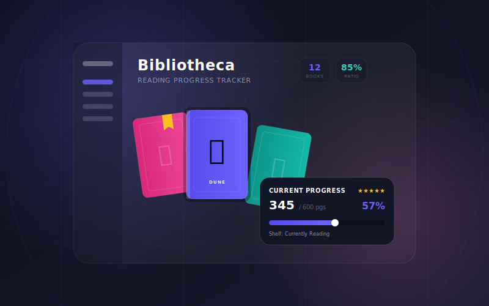

# 📚 Bibliotheca — Book Library Tracker

A premium, glassmorphic **Book Library Application** built entirely with vanilla **HTML5, CSS3, and JavaScript**. Track your current books, manage collections, search your library, and visualize your reading progress in real-time.



---

## ✨ Core Features

1. **📖 Reading Progress Tracker**:
   - Easily update your current page number and keep tabs on total pages.
   - Dynamic real-time calculation of percentage completion with animated progress bars.
   - Smart shelf transitions: setting progress to 100% automatically updates the book to the **Completed** shelf.

2. **📂 Custom Collections & Shelves Management**:
   - Organize books into standard shelves (`Want to Read`, `Currently Reading`, `Completed`, `On Hold`, `Dropped`).
   - Create custom curated collections with unique names and emojis (e.g. *🌟 Favorites*, *🚀 Sci-Fi*, *👤 Biographies*).
   - Sidebars dynamically count the total number of books under each shelf and collection in real-time.

3. **🔍 Robust Search & Sorting**:
   - Instant search across titles, authors, genres, notes, and ISBN.
   - Sort library items by **Recently Added**, **Title (A-Z/Z-A)**, **Author**, **Progress**, and **Rating**.

4. **💅 Rich & Premium Dark-mode Aesthetics**:
   - Curated HSL violet/pink/teal color scheme.
   - Responsive layouts featuring staggered card entrance animations, smooth hover states, responsive hamburger sidebars for mobile, and slide-in notifications/toasts.

5. **💾 LocalStorage Abstraction**:
   - Keeps your bookshelf persistent across sessions using zero-dependency local storage.
   - Populates the application with sample demo content on first launch.

---

## 📂 Project Directory Structure

```text
Book Library/
├── index.html          # Semantic markup, sidebar structure, and modal dialogues
├── thumbnail.svg       # SVG project cover thumbnail design
├── README.md           # Project documentation and feature breakdown
├── css/
│   └── style.css       # Complete stylesheet (glassmorphic styling, animations, responsive design)
└── js/
    ├── storage.js      # LocalStorage wrapper logic for CRUD actions
    ├── data.js         # Dummy data provider for a beautiful initial layout
    ├── ui.js           # UI updates, modal bindings, toast displays, filter rules
    └── app.js          # Main program runner, handles DOM registration and event loops
```

---

## 🛠️ Setup & Usage Instructions

Since this project uses a pure vanilla frontend stack, **no build systems, compilation, or package installers are needed**. It runs immediately out-of-the-box.

### Option 1: Open Locally (Double-Click)
Navigate to the directory and double-click `index.html` to run the application immediately in any web browser.

### Option 2: Live Server (Recommended)
To run the project over a local server environment (supporting local assets/emojis fully):
- **VS Code**: Install the *Live Server* extension and click **Go Live**.
- **Python**: Run `python -m http.server 8000` in the directory, then open `http://localhost:8000`.
- **Node/Npx**: Run `npx serve` inside the folder.
